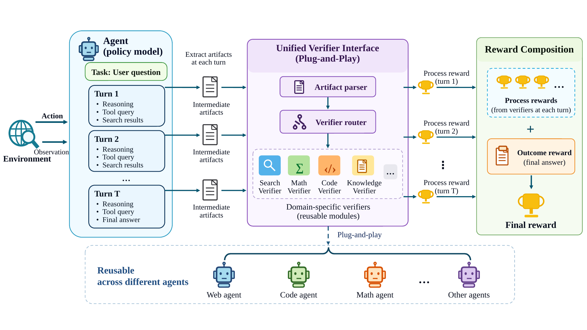
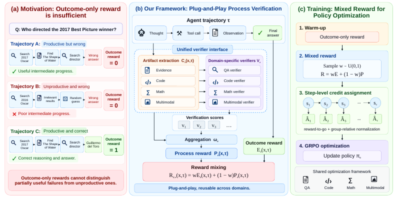
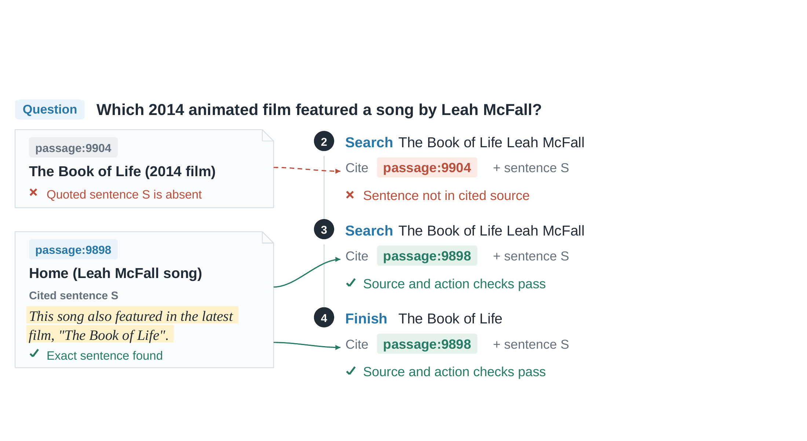
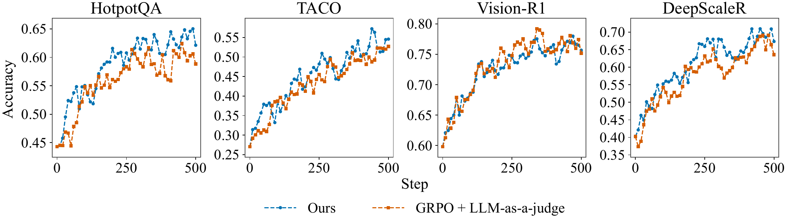

# Plug-and-Play Verifier for Decoupling Process Reward in Stabilizing Long-Horizon Agentic Reasoning

> Turn checks of intermediate artifacts into bounded, step-attributed process rewards through a shared interface, and reuse them across compatible agents and policy optimizers.

Research code for the ICLR 2027 manuscript. Built on [Agent-R1](https://github.com/AgentR1/Agent-R1) and [veRL](https://github.com/volcengine/verl).



**Figure 1: Overview of the plug-and-play verifier.** *Left:* artifacts are extracted per turn. *Middle:* a unified interface routes them to domain-specific verifiers, which return explicit and decoupled process rewards. *Right:* Rewards are combined with the final outcome reward. *Bottom:* verifiers interact with RL post-training through the interface and can be used independently across agents.

[Overview](#overview) · [Method](#method) · [Results](#results) · [Getting Started](#getting-started) · [Evaluation](#evaluation) · [Project Structure](#project-structure)

## Overview

A correct final answer does not reveal whether the intermediate work was valid. An incorrect answer can also conceal useful progress. Outcome-only rewards therefore leave important differences between reasoning trajectories unresolved.

We make that progress explicit by checking artifacts such as numeric equalities, evidence citations, code executions, and image crops. Each domain verifier returns **bounded credits and their source-step indices** through the same `VerificationResult` contract. A shared reward composer combines these credits with final-answer correctness before GRPO or PPO optimization.

The framework separates three responsibilities:

1. **Verification:** domain modules own artifact parsing, evidence access, local checks, and credit normalization.
2. **Reward composition:** shared code controls outcome/process mixing and places rewards at the appropriate policy steps.
3. **Policy optimization:** the trainer consumes composed step rewards without interpreting domain artifacts or verification rules.

The proposed process verifiers use deterministic checks rather than an LLM judge or annotated gold evidence. Reference answers and held-out tests are still used for **outcome rewards**. A frozen LLM judge and gold-evidence supervision are separate comparison arms.

## Method



**Figure 2: Overview of plug-and-play process verification.** (a) Identical outcome rewards can mask differences in intermediate verification results. (b) Local checks are decoupled from policy reasoning and provide step-attributed credits through a common interface. These credits are combined with outcome rewards for GRPO or PPO training. Differences in process returns can provide a last-mile signal within outcome-tied GRPO groups.

### Unified verification contract

A domain adapter returns source-step indices and nonnegative credits:

```math
\Phi_d(x,\tau)=\{(s_\ell,q_\ell)\}_{\ell=1}^{n},
\qquad q_\ell\geq 0,\quad \sum_{\ell=1}^{n}q_\ell\leq 1.
```

The implementation also carries credit-level and trajectory-level audit metadata:

```python
from agent_r1.verifier.reward import VerificationCredit, VerificationResult

# Illustrative output from a domain verifier.
result = VerificationResult(
    credits=(
        VerificationCredit(step_index=2, score=0.25, audit={"check": "passed"}),
        VerificationCredit(step_index=3, score=0.50, audit={"check": "passed"}),
    ),
    audit={"domain": "example"},
)
```

**Plug-and-play means preserving this contract.** Replacing a compatible verifier leaves reward composition and policy optimization unchanged. Reusing it with another agent still requires an adapter for that agent's artifacts and evidence records. A passing check establishes the property tested by its rule; it does not certify the entire reasoning narrative or guarantee a correct final answer.

### Decoupled reward composition

Let `E` be the final outcome reward, and let `p_t` sum the process credits assigned to interaction step `t`. For a trajectory with a valid final submission:

```math
r_t=w_{k,g}\,\mathbf{1}\{t=T\}\,E+(1-w_{k,g})p_t,
\qquad R=\sum_t r_t=w_{k,g}E+(1-w_{k,g})P.
```

- **Updates 1-50:** use outcome-only reward, `w = 1`.
- **After warmup:** sample one reproducible `w ~ Uniform(0,1)` per update and prompt group, shared by that group's rollouts.
- **Credit placement:** outcome reward goes to the final policy step; process credits remain at their source steps, even when checked after rollout.
- **Final-submission eligibility:** missing final submissions receive zero composed reward. A submitted answer can be incorrect and still receive valid process credit.
- **Validation:** uses outcome-only rewards, with verification audits recorded separately.

GRPO computes undiscounted reward-to-go and normalizes returns within the same prompt and step index. Each step's advantage applies to its generated policy tokens; prompt and environment-observation tokens are masked. PPO can consume the same composed rewards through its critic and GAE path.

The interface and composer live in [`agent_r1/verifier/reward.py`](agent_r1/verifier/reward.py). See the [implementation contract](docs/paper-contract.md) for normalization, eligibility, and evaluation details.

### Domain verifiers

| Domain | Training data | Evaluation benchmark | Locally checked artifacts |
| --- | --- | --- | --- |
| Mathematics | DeepScaleR-Preview-Dataset | AIME 2025 | Extracted numeric equalities |
| Multi-hop QA | HotpotQA | HotpotQA validation | Retrieved source spans, provenance, and action/answer coupling |
| Code | TACO | LiveCodeBench | Code-version lineage, developer-test evidence, and execution replay |
| Vision | Vision-R1-RL | MATH-Vision | Image-crop replay and string-level answer/claim coupling |

Training is separate for each domain. Domain-specific parsers and checks remain inside the recipes; downstream training uses the shared credit contract.

### A concrete verification example



**Figure 3: An example of our plug-and-play verifier on HotpotQA.**

## Results

The values below are transcribed from **Tables 1-3 of the accompanying manuscript**. They are paper-reported results, not measurements generated by the repository's CPU tests. Accuracy is based on the final submitted answer or program; `Avg.` is the unweighted mean across the four benchmarks.

### Qwen3.5-4B

| Method | AIME 2025 | HotpotQA | LiveCodeBench | MATH-Vision | Avg. |
| --- | ---: | ---: | ---: | ---: | ---: |
| ReAct | 26.67 | 46.78 | 40.47 | 75.72 | 47.41 |
| GRPO | 33.33 | 57.73 | 47.96 | 79.80 | 54.71 |
| GRPO + LLM-as-a-judge | 36.67 | 58.28 | 48.72 | **82.01** | 56.42 |
| **Ours (verification)** | **40.00** | **60.18** | **49.57** | 81.51 | **57.82** |

### Qwen3.5-9B

| Method | AIME 2025 | HotpotQA | LiveCodeBench | MATH-Vision | Avg. |
| --- | ---: | ---: | ---: | ---: | ---: |
| ReAct | 36.67 | 52.56 | 49.00 | 79.47 | 54.43 |
| GRPO | 43.33 | 63.20 | 56.59 | 83.19 | 61.58 |
| **Ours (verification)** | **46.67** | **66.67** | **58.48** | **84.80** | **64.16** |

In the reported experiments, verification improved outcome accuracy over GRPO on all four benchmarks at both model scales. At 4B, it also achieved higher average accuracy than the frozen Qwen3.5-9B process-judge baseline, with gains on three benchmarks; the judge baseline remained higher on MATH-Vision.

### Training dynamics



**Figure 4: Training accuracy of Qwen3.5-4B with Ours and GRPO with LLM-as-a-judge.**

### Reuse across policy optimizers

HotpotQA with Qwen3.5-4B, as reported in manuscript Table 3:

| Algorithm | Outcome only | + Verification | Gain (percentage points) |
| --- | ---: | ---: | ---: |
| GRPO | 57.73 | **60.18** | +2.45 |
| PPO | 55.10 | **57.60** | +2.50 |

<details>
<summary><strong>HotpotQA ablations: verification source and reward composition</strong></summary>

All values below are reported for Qwen3.5-4B with GRPO in manuscript Table 2.

| Process feedback added to outcome-only GRPO | Accuracy (%) |
| --- | ---: |
| None: outcome-only GRPO | 57.73 |
| Frozen LLM judge | 58.28 |
| **Our verifier** | **60.18** |
| Gold evidence (privileged upper bound) | 61.40 |

Our verifier does not require annotated gold evidence. The following reward-composition ablation **does use gold-evidence process rewards**; its 61.40 score is not the proposed verifier's score.

| Reward configuration | Accuracy (%) |
| --- | ---: |
| ReAct | 46.78 |
| Outcome only | 57.73 |
| Gold process only | 47.27 |
| Outcome + gold process | 61.40 |

</details>

## Getting Started

### Environment

Use a Linux GPU environment with **veRL 0.7.0**, PyTorch/FSDP, vLLM, Ray, and compatible Transformers dependencies. The launchers use Bash features available in Bash 4 or later. Follow the [veRL installation documentation](https://verl.readthedocs.io/en/latest/start/install.html) for the infrastructure overview, selecting a dependency stack compatible with this repository's veRL version; the latest upstream defaults target a newer stack.

```bash
git clone https://github.com/momo1443/plug-and-play-verification.git
cd plug-and-play-verification

# Use the Python interpreter from your activated training environment.
export PYTHON_BIN="$(command -v python)"
```

Run commands from the repository root. HotpotQA additionally needs the packages in [`recipes/hotpotqa/requirements.txt`](recipes/hotpotqa/requirements.txt), a retrieval index, an embedding model, and an evidence sidecar. TACO execution requires the Linux `bubblewrap` sandbox. Environment-specific compatibility patches are under [`scripts/patches/`](scripts/patches/).

### Prepare data and models

| Domain | Inputs expected by the paper launcher | Setup entry point |
| --- | --- | --- |
| DeepScaleR | Prepared `train.parquet` and `validation.parquet` in `data/corpus/deepscaler/` | [Recipe notes](recipes/deepscaler/README.md); source-to-paper-parquet preprocessing is not bundled |
| HotpotQA | Prepared splits, corpus, FAISS index, embedding model, and evidence sidecar | [Data and retrieval setup](recipes/hotpotqa/README.md) |
| TACO | Prepared splits and developer/private-test sidecars | [`prepare_data.py`](recipes/taco_a9/prepare_data.py), [`build_sidecar_index.py`](recipes/taco_a9/build_sidecar_index.py) |
| Vision-R1 | Official `train.parquet` and `test.parquet`, with resolvable image data | [`prepare_data.py`](recipes/vision_r1/prepare_data.py); invoked by the launcher |

Default model paths are `../models/Qwen3.5-4B` and `../models/Qwen3.5-9B`. Set the corresponding domain variable (`DEEPSCALER_MODEL_PATH`, `HOTPOTQA_MODEL_PATH`, `TACO_A9_MODEL_PATH`, or `VISION_R1_MODEL_PATH`) when using another location. Data paths and GPU layouts are configured by each launcher; check them before starting a run.

### Train with the verifier

Choose the command for the prepared domain:

```bash
bash scripts/deepscaler/run_deepscaler_a9_uniform.sh
bash scripts/hotpotqa/run_a9_uniform.sh
bash scripts/taco/run_a9_uniform.sh
bash scripts/vision_r1/run_a9_uniform.sh
```

Example with an explicit model path and run name:

```bash
DEEPSCALER_MODEL_PATH=/path/to/Qwen3.5-4B \
RUN_ID=deepscaler_4b_verifier \
bash scripts/deepscaler/run_deepscaler_a9_uniform.sh
```

### Baselines and comparisons

| Domain | Outcome-only GRPO |
| --- | --- |
| DeepScaleR | `bash scripts/deepscaler/run_deepscaler_a1.sh` |
| HotpotQA | `bash scripts/hotpotqa/run_a1.sh` |
| TACO | `bash scripts/taco/run_a1_terminal.sh` |
| Vision-R1 | `bash scripts/vision_r1/run_a1_terminal.sh` |

```bash
# Frozen process judge: deepscaler, hotpotqa, taco, or vision.
bash scripts/llm_judge/run_grpo_4b_judge_9b.sh hotpotqa

# Outcome-only PPO through the matched task interface.
bash scripts/ppo/run_terminal.sh hotpotqa

# HotpotQA verifier with PPO.
HOTPOTQA_OPTIMIZER=ppo bash scripts/hotpotqa/run_a9_uniform.sh

# Privileged gold-evidence ablations on HotpotQA.
bash scripts/hotpotqa/run_a2.sh  # process only
bash scripts/hotpotqa/run_a3.sh  # fixed 0.5 outcome/process mixture
```

The [launcher index](scripts/README.md) lists evaluation entrypoints, 9B wrappers, and optional extensions. DeepScaleR ToolEnv and HotpotQA A8 have separate protocols under `scripts/extensions/`.

### Paper training profiles

All paper profiles select a 10,000-row training prefix and use 500 updates, four rollouts per prompt, actor learning rate `1e-6`, actor-loss KL coefficient `0.001`, and seed `42`. Qwen3.5-4B uses full fine-tuning; Qwen3.5-9B uses LoRA with rank and alpha `64`.

| Domain | Prompt batch (4B / 9B) | Max prompt tokens | Max completion tokens (4B / 9B) | Max policy steps |
| --- | ---: | ---: | ---: | ---: |
| DeepScaleR | 20 / 20 | 2048 | 4096 / 5120 | 1 |
| HotpotQA | 20 / 8 | 8192 | 1024 / 1024 | 4 |
| TACO | 20 / 20 | 8192 | 2048 / 2048 | 5 |
| Vision-R1 | 8 / 8 | 8192 | 2048 / 2048 | 3 |

Completion limits apply per policy generation. A selected prefix is not the same as the number of sampled prompts: for example, batch 8 over 500 updates samples 4,000 prompts. Run manifests record both quantities. Model adaptation and overrides are documented in [`scripts/common/README.md`](scripts/common/README.md).

## Evaluation

AIME 2025, HotpotQA, LiveCodeBench, and MATH-Vision measure final task correctness. Select the intended checkpoint, benchmark release, and inference budget explicitly. TACO and Vision-R1 training validation are diagnostics; they do not replace LiveCodeBench and MATH-Vision evaluation.

For a checkpoint exported in a format accepted by vLLM, with prepared AIME data:

```bash
CUDA_VISIBLE_DEVICES=0 \
MODEL_PATH=/path/to/exported-checkpoint \
AIME2025_DATA_DIR=/path/to/prepared/aime2025 \
OUTPUT_DIR=outputs/aime2025 \
python scripts/deepscaler/eval_aime2025.py
```

For a renamed 9B checkpoint, also set `AGENT_R1_MODEL_SCALE=9b` to select the 9B completion budget. The [evaluation index](scripts/README.md#evaluation) points to the other benchmark utilities.

Verification audits provide two additional quantities from manuscript Eq. (9): `C_d` indicates that a nonempty set of applicable checks all pass; `M_d` averages `E_d * C_d`. Missing required evidence and earlier failed checks remain part of the audit. These quantities are separate from the graded process reward and from revision/retesting statistics.

```bash
python -m agent_r1.evaluation.summarize validation.jsonl --output metrics.json
# Select one update when summarizing a training dump.
python -m agent_r1.evaluation.summarize rollouts.jsonl --global-step 500
```

## Project Structure

```text
plug-and-play-verification/
├── agent_r1/
│   ├── verifier/          # Shared credit contract and reward composition
│   ├── agent_flow/        # Policy generation and environment interaction
│   ├── trainer/           # GRPO/PPO, step advantages, and training records
│   ├── evaluation/        # Final-answer extraction and verification metrics
│   └── config/            # Shared Hydra configuration
├── recipes/               # Domain flows, verifiers, data preparation, and YAML configs
├── scripts/
│   ├── deepscaler/        # Paper math training and AIME evaluation
│   ├── hotpotqa/          # QA training, ablations, and validation
│   ├── taco/              # Code training
│   ├── vision_r1/         # Visual-agent training
│   ├── llm_judge/          # Frozen process-judge baseline
│   ├── ppo/               # Outcome-only PPO entrypoint
│   ├── common/            # Shared model adaptation and paper budgets
│   ├── extensions/        # Optional and historical experiment profiles
│   └── patches/           # Runtime compatibility patches
├── tests/                 # Verifier, reward, launcher, and trainer checks
├── assets/images/         # Figures 1-4 from the manuscript
├── docs/                  # Implementation notes and archived records
└── verl_patches/          # Weight-transfer support
```

See the [repository guide](docs/README.md) for the complete directory map and the paths moved during cleanup.

## Validation and Reproducibility

The focused CPU suite checks reward contracts, answer extraction, launcher arguments, and agent-flow wiring with mocked generation/execution boundaries:

```bash
python -m pytest -q \
  tests/test_paper_alignment.py tests/test_paper_launcher_config.py \
  tests/test_deepscaler_reward.py tests/test_verifier_reward.py \
  tests/test_hotpotqa_a9.py tests/test_taco_a9.py \
  tests/test_cross_domain_llm_judge.py tests/test_process_judge_flows.py
```

These checks do not establish GPU training stability or reproduce the paper's reported scores. Reproduction requires the corresponding model checkpoints, data snapshots, environment, run manifests, and raw evaluation outputs. The current protocols and known implementation limits are recorded in [the paper contract](docs/paper-contract.md).

## Acknowledgements and License

This implementation builds on [Agent-R1](https://github.com/AgentR1/Agent-R1), [veRL](https://github.com/volcengine/verl), and [vLLM](https://github.com/vllm-project/vllm). We thank their contributors and the creators of the evaluation benchmarks. See [LICENSE](LICENSE) for the repository license and retained upstream notice.
